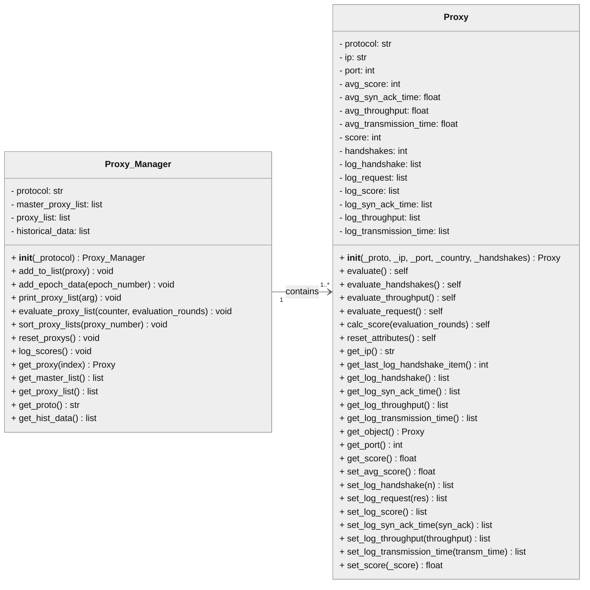

# Validation-of-Public-Proxy-Servers-using-Internet-Wide-Scanning
The Repository is an Investigation of public proxy servers. Proxy Servers should be identified using an Internet-Wide-Scanning Technique. Objects should be evaluated/validated in order to make a statement how proxy servers of the public adress space are available and reliable. 
This is a test line of code to be pushed to origin.

# Class Diagram
Illustrates the Proxy Manager and Proxy classes with Getters & Setters.  
 
 

