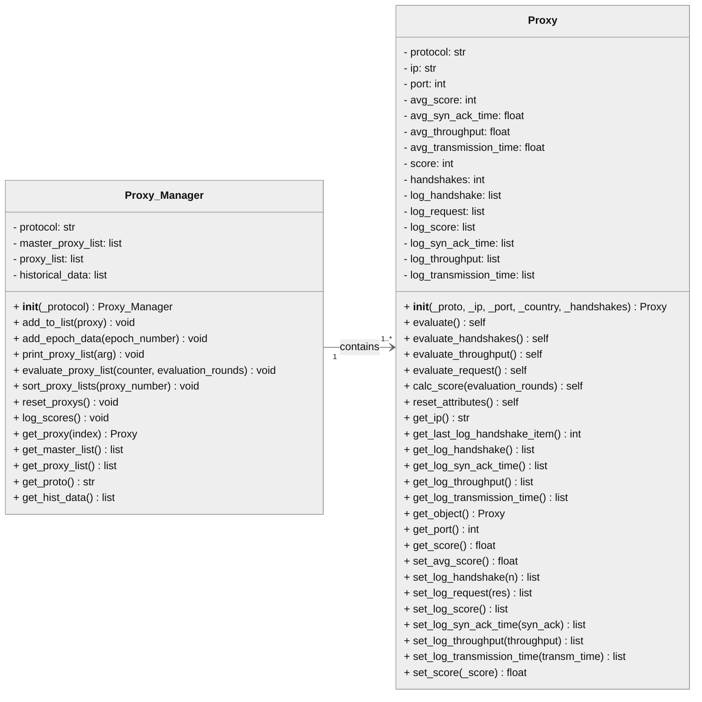
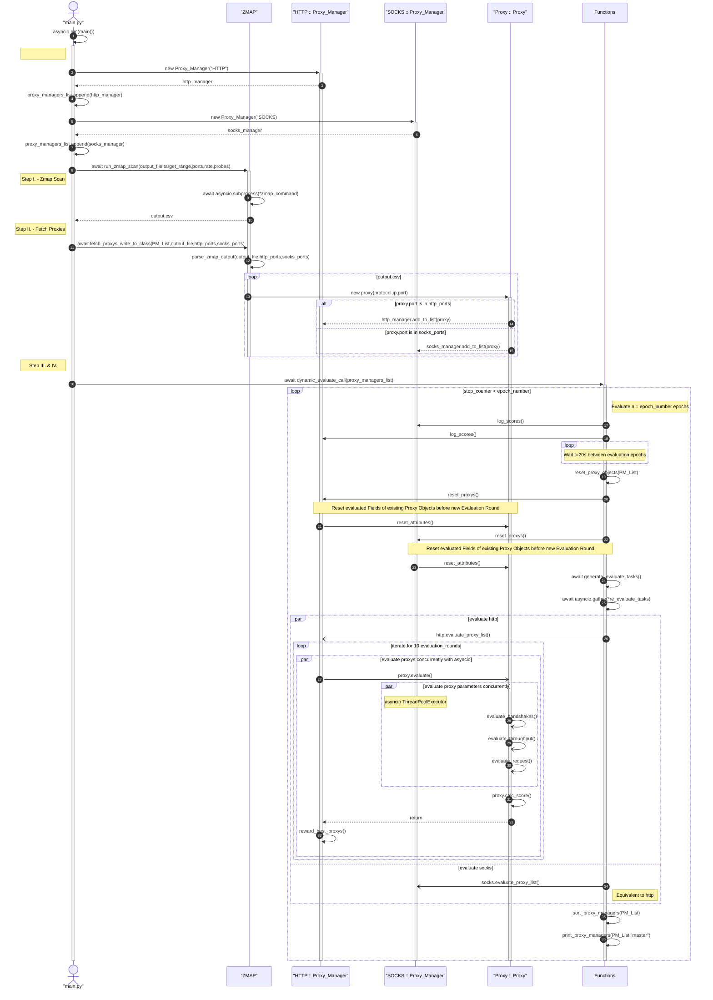

# Validation-of-Public-Proxy-Servers-using-Internet-Wide-Scanning
The Repository's purpose is an Investigation of public proxy servers. Proxy Servers are identified using the open-source internet-wide-scanning Tool Zmap.   Objects should be evaluated in order to make a statement how proxy servers of the public adress space are available and reliable.  

# Class Diagram
Illustrates the Proxy Manager and Proxy classes with Getters & Setters.  
 
 

# Sequence Diagram
The Sequence Diagram illustrating the program control flow of the proxy validation python script.

```mermaid 

sequenceDiagram
    autonumber
    actor main as "CLI - main"
    
    participant socks5 as "SOCKS5   :Proxy_Manager"
    participant http as "HTTP   :Proxy_Manager"
    participant broker as "Broker   :proxybroker"
    participant proxy as Proxy
    participant functions as Functions

    
    main->>main: run(proxy_number: int, evaluation_rounds: int, protocols: set)
    main->>+main: asyncio.get_event_loop()
    loop
      
      main->>main: loop.run_until_complete(main(proxy_number, evaluation_rounds, protocols))
      
      
      main->>+http: new   Proxy_Manager("HTTP")
      http-->> main: http
      main->>main: fetch_tasks.append(http.fetch_proxy_write_to_class())
      main->>main: evaluate_tasks.append(http.evaluate_proxy_list())
      

      main->>+socks5: new   Proxy_Manager("SOCKS5")
      socks5-->>main: socks5

      main->>main: fetch_tasks.append(socks5.fetch_proxy_write_to_class())
      main->>main: evaluate_tasks.append(socks5.evaluate_proxy_list())
      
      
      main->>main: await asyncio.gather(*fetch_tasks)
      par fetch http
          
        main-)http: fetch_proxys_write_to_class()
        http-)+broker: new   Broker()
        broker-)broker: find(protocol,lvl = 'HIGH',limit=proxy_num)
        broker--)http: return proxies
        http-)http: write_proxy_to_class(proxies)
        http-)+proxy: new   proxy(type,ip,port,country,evaluation_rounds)
        proxy--)http: return proxy
        proxy->>http: add_to_list(<proxy>)
        deactivate broker
      and fetch socks5
        main-)socks5: fetch_proxys_write_to_class()
        socks5-)+broker: new   Broker()
        broker-)broker: find(protocol,lvl = 'HIGH',limit=proxy_num)
        broker--)socks5: return proxies
        socks5-)socks5: write_proxy_to_class(proxies)
        socks5-)proxy: new   proxy(type,ip,port,country,evaluation_rounds)
        proxy--)socks5: return proxy
        proxy->>socks5: add_to_list(<proxy>)
        deactivate broker
      end

      main->>main: await asyncio.gather(*evaluate_tasks)
      par evaluate http
          
        main-)http: http.evaluate_proxy_list()
        loop evaluation_rounds
          par evaluate proxys concurrently with asyncio
            http-)proxy: proxy.evaluate()
            par
              proxy-)proxy: evaluate_handshakes()
              proxy-)proxy: evaluate_throughput()
              proxy-)proxy: evaluate_request()
            end
            proxy->>proxy: proxy.calc_score()
            proxy-->>http: return
            http->>http: reward_best_proxys()
          end
        end
        
      and evaluate socks5
        main-)socks5: socks5.evaluate_proxy_list()
        loop evaluation_rounds
          par evaluate proxys concurrently with asyncio
            socks5-)proxy: proxy.evaluate()
            par
              proxy-)proxy: evaluate_handshakes()
              proxy-)proxy: evaluate_throughput()
              proxy-)proxy: evaluate_request()
            end
            proxy->>proxy: proxy.calc_score()
            proxy-->>socks5: return
            socks5->>socks5: reward_best_proxys()
          end
        end
      end
      

      main->>main: await sort_proxy_managers()
      loop
        
        Note right of main: Remove Proxys with score <100
        main->>http:sort_proxy_lists()
        main->>socks5: sort_proxy_lists()
      end 
      
      main->>functions:await rec_wait_and_evaluate_again()
      functions->>http: log_scores()
      functions->>socks5: log_scores()
      functions->>main: await print_proxy_managers()
      loop
        Note over functions: Wait 20s
      end
      functions->>functions: await Checker()
      loop CHECKER ACTIVE
        alt CHECK APPROVED - CONTINUE
          
        else CHECK REJECT - REFILL
          functions-)functions: await asyncio.gather(*refresh_tasks)
          par Refresh HTTP Proxy List
            functions-)http: http.refresh_proxy_list()
          and Refresh SOCKS5 Proxy List
            functions-)socks5: socks5.refresh_proxy_list()
          end
        end
      end
      functions->>functions: reset_proxy_objects()
      
      functions->>http: reset_proxys()
      Note over http,proxy: Reset evaluated Fields of existing Proxy Objects before new Evaluation Round
      http->>proxy: reset_attributes()
      
      functions->>socks5: reset_proxys()
      Note over socks5,proxy: Reset evaluated Fields of existing Proxy Objects before new Evaluation Round
      socks5->>proxy: reset_attributes()

      functions-)functions: await asyncio.gather(*re_evaluate_tasks)
      
      par evaluate http
        functions-)http: http.evaluate_proxy_list()
      and evaluate socks5
        functions-)socks5: socks5.evaluate_proxy_list()
      end
      functions->>functions: await sort_proxy_managers()
      functions->>functions: await print_proxy_managers("master")
      functions->>functions: await rec_wait_and_evaluate_again()

      deactivate proxy
      deactivate http
      deactivate socks5
      deactivate main
    end
    
```
 
 
 

# Sequence Diagram ZMAP

