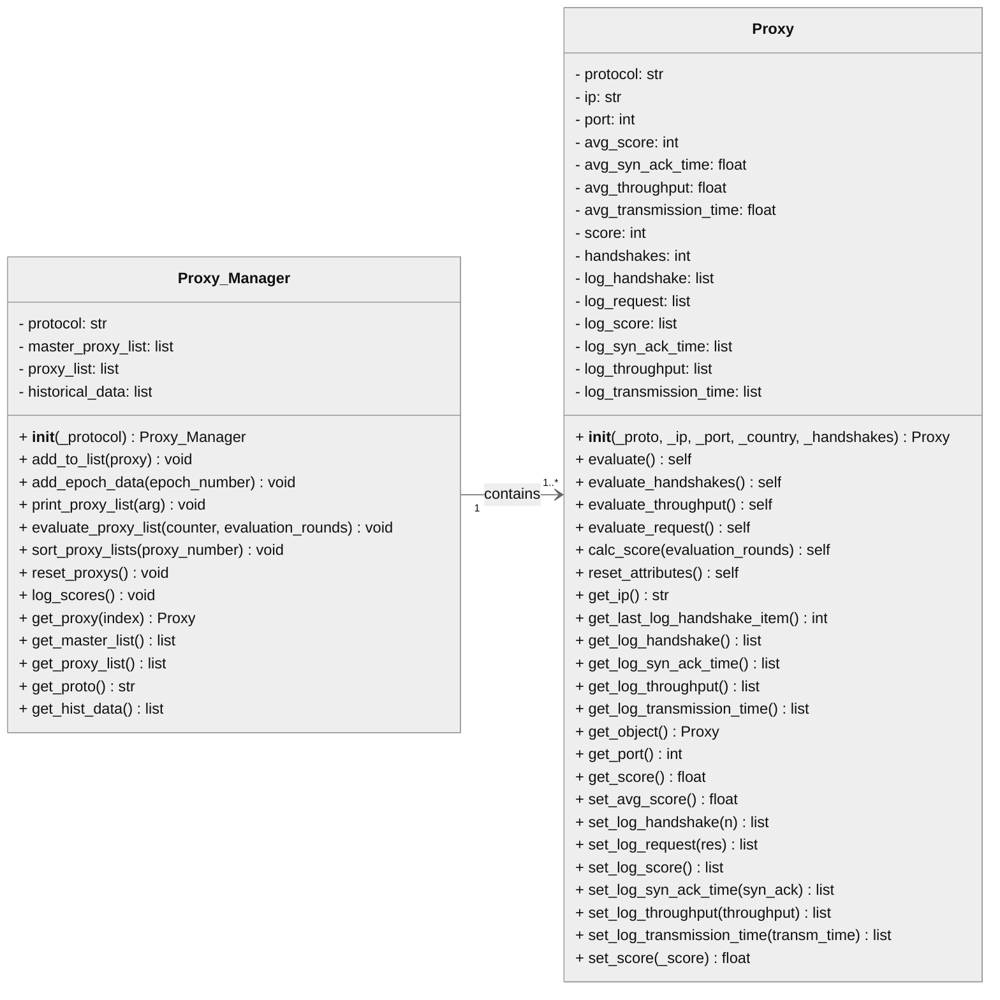
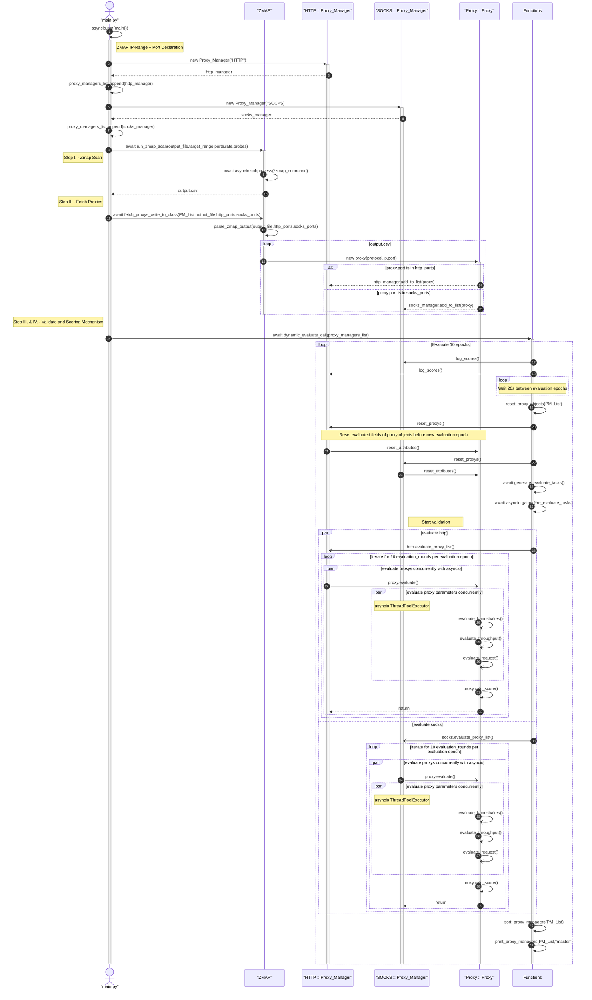

# Validation-of-Public-Proxy-Servers-using-Internet-Wide-Scanning
The Repository's purpose is an investigation of public proxy servers. Proxy Servers are identified using the open-source internet-wide-scanning tool Zmap.   Objects should be evaluated in order to make a statement how proxy servers of the public adress space are available and reliable.  

# Class Diagram
Illustrates the Proxy Manager and Proxy class with Getters & Setters.  
 
 

# Sequence Diagram - ZMap Scan & Validation Data Structure
The sequence diagram shows the program control flow.  
The defined network address space is scanned(tcp-port scan) in order to detect running and open public proxy services.  
In addition the output is used to parse the data and run validation methods in order to get a ranked list of more and less reliable proxy objects.

